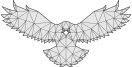
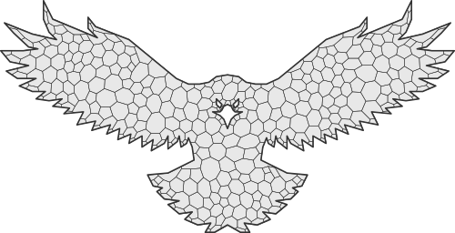

# Triangulation

複雑なポリゴンの三角形分割、テッセレーション、および凸多角形への分割。「単調なポリゴンの三角形分割」に基づく高速 O(n*log(n)) アルゴリズム。結果はドロネー三角形分割として表すことができます。
## Delaunay triangulation

## Triangulation with extra points

## Tessellation

## Centroid net

## Quick Start Notes:

1. Add images to the *images* folder if the file is referencing an image.